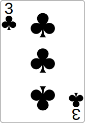

<p align="center">
    </img>
</p>

# A simple card trick powered by a website

## Instructions

- Ask your victims to pick a card out of a deck, show it among them, but not to you
- Make sure they get convinced you cannot possibly guess this card (ask all of them to shuffle it, walk out of the room, etc...)
- Once they all know the card, ask them to put it back in the deck
- Walk back in, pick the deck, make up some woowoo stuff (handwave on top of the deck, pretend to be puzzled, then enlightened, frown, smile, show anger, frustration, etc...  Go wild!)
- Finally pick a card with a convincing "AH AH! GOT IT!"
- Show it to them
- Of course, it's wrong
- If it's not wrong, drop the microphone and walk out of the room in triumph
- But come on, it's wrong
- Show confusion, anger, frustration
- Give it another go
- Fail again
- "Okay, fine, I give up. What was it?!?"

The victims tell you the card.

Acting time! Facepalm, show befuddlement, "Damn..."

- "I'm not smart enough to guess that card..."
- "... which is why, I wrote some code to guess this card for me"
- "That's right! I coded a website that knows your card"
- "Don't believe me? Let's go there right now! Grab a laptop, go to https://beust.com/card"

Participants eagerly go to the website, then the person at the keyboard says

- "There's a password!"

Feign surprise, then have a "Doh!" moment

- "Oh, right, sorry, forgot to turn that off. Let me type it in"

Grab the laptop, type the password.

Enjoy victory as the website shows the correct card.

# The trick

Surely you have guessed it by now: the password is what instructs the website to show the right card. More specifically, only the first two characters matter (feel free to type garbage after for effect).

The first character is the value of the card, the second character is the suit. Here is the code:

```
                    switch (password[0]) {
                        case 'a': value = "ace"; break;
                        case '2': value = "2"; break;
                        case '3': value = "3"; break;
                        case '4': value = "4"; break;
                        case '5': value = "5"; break;
                        case '6': value = "6"; break;
                        case '7': value = "7"; break;
                        case '8': value = "8"; break;
                        case '9': value = "9"; break;
                        case '1': value = "10"; break;
                        case 'j': value = "jack"; break;
                        case 'q': value = "queen"; break;
                        case 'k': value = "king"; break;
                    }
                    switch(password[1]) {
                        case 'c': suit = "clubs"; break;
                        case 'd': suit = "diamonds"; break;
                        case 'h': suit = "hearts"; break;
                        case 's': suit = "spades"; break;
                    }
```

For example, "Ace of hearts" is "ah&lt;whatever&gt;", "Ten of diamonds" is "1d&lt;whatever&gt;", "Queen of Clubs" is "qc&lt;whatever&gt;", etc... You get the idea.

Enjoy!
